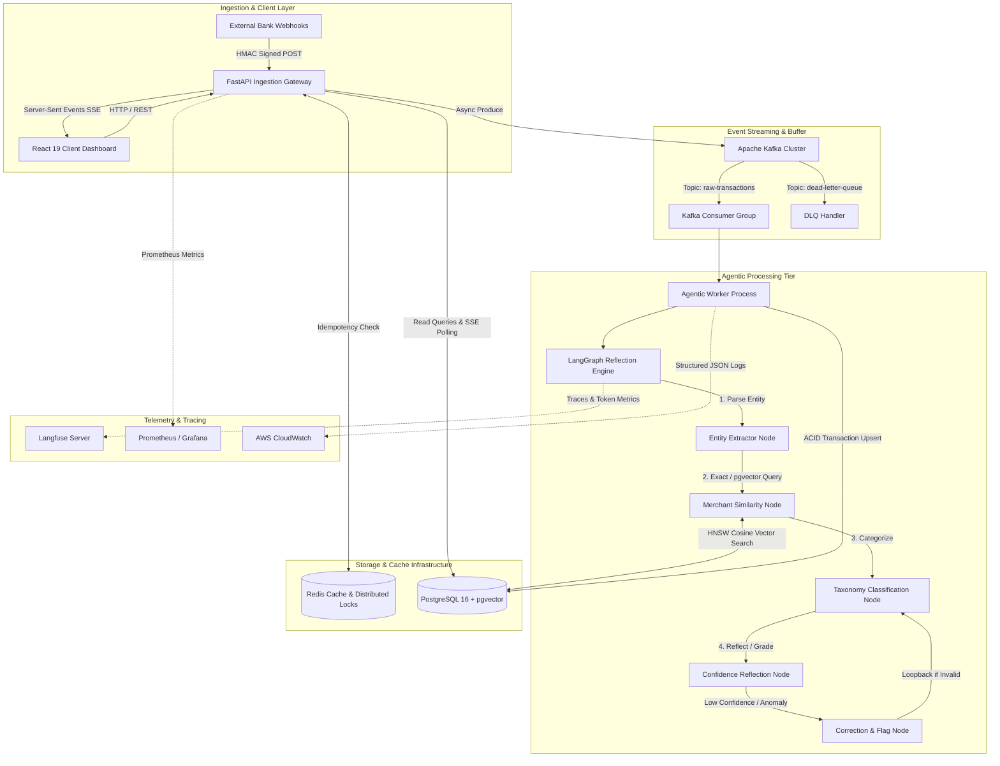
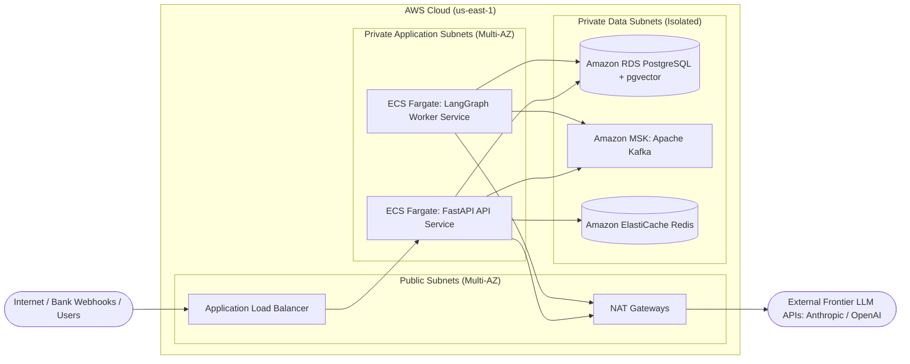
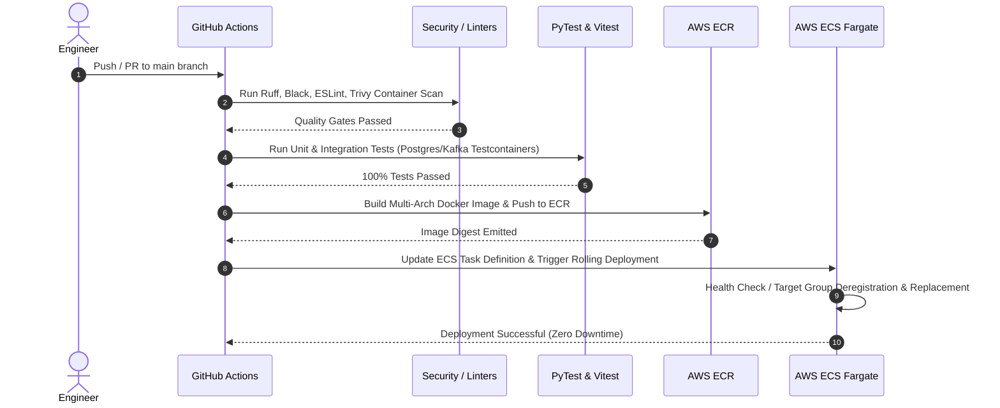

# Architecture Specification: Multi-Account Financial Categorizer & Intelligence Agent

## 1. Component Topology

---

## 2. Cloud Infrastructure Architecture (AWS Production Target)

### Infrastructure Specifications

1. **Networking & VPC Topology:**
   * 3 Availability Zones (AZs) for high availability.
   * Public subnets host internet-facing Application Load Balancers (ALBs) and NAT Gateways.
   * Private Application subnets host containerized tasks on **AWS ECS Fargate** with zero public IP addresses.
   * Isolated Database subnets have no internet egress, accessible only via security groups from application subnets.

2. **Compute Service (AWS ECS Fargate):**
   * **API Service:** Autoscales based on CPU/Memory and ALB Request Count (Target Tracking at 70% CPU, min 2 tasks, max 10 tasks).
   * **Worker Service:** Autoscales based on Kafka Consumer Lag metrics exported to CloudWatch (min 2 tasks, max 8 tasks).

3. **Storage & Messaging:**
   * **Amazon MSK (Managed Streaming for Apache Kafka):** 3-broker cluster, 3 partitions per topic, retention set to 7 days, SASL/SCRAM authentication over TLS.
   * **Amazon RDS PostgreSQL 16:** Multi-AZ deployment, `pgvector` extension enabled, SSD gp3 storage with autoscaling, read replica for read-heavy UI queries.
   * **Amazon ElastiCache for Redis:** In-memory distributed lock manager (Redlock) for transaction idempotency and token bucket rate-limiting.

---

## 3. Caching & Security Architecture

### 3.1 Webhook Authentication & Security
* **HMAC-SHA256 Signature Verification:** Incoming bank webhooks include `X-Signature-SHA256` computed over the raw payload using a pre-shared secret. Payloads with invalid signatures are rejected at the edge with `401 Unauthorized` before parsing.
* **Replay Attack Mitigation:** Payloads contain a timestamp. Requests older than 300 seconds are rejected automatically.

### 3.2 Idempotency Pipeline
1. Inbound webhook contains external transaction ID `ext_id` and `account_id`.
2. A deterministic idempotency key is computed: `SHA256(account_id + ":" + ext_id)`.
3. Worker invokes `SET key value NX EX 86400` in Redis.
4. If key exists, the message is acknowledged and discarded as a duplicate webhook event.
5. In PostgreSQL, a unique constraint `UNIQUE (account_id, ext_transaction_id)` guarantees ACID-level deduplication.

### 3.3 Rate Limiting & Protection
* Redis-backed sliding window rate limiter protects the ingestion endpoint (`100 req/sec per bank partner`).
* LLM calls are guarded by circuit breakers: if upstream LLM provider error rate exceeds 15% over 1 minute, fallback to pure pgvector cosine matching occurs automatically without failing the worker.

---

## 4. CI/CD Workflow Lifecycle

---

## 5. Resilience & Fault Recovery Modes

| Failure Scenario | Mitigation Mechanism | RTO / RPO |
| :--- | :--- | :--- |
| **Kafka Broker Failure** | MSK Multi-AZ broker replication (`min.insync.replicas=2`). Producers use `acks=all`. | RTO < 30s, RPO = 0 |
| **LLM Provider Outage** | Circuit Breaker trips to `pgvector` cosine similarity mode using historical merchant cache. | Instant fallback, 0 dropped messages |
| **Malformed Payload / Poison Pill** | Message retries 3 times with exponential backoff; on 4th failure, routed to `dead-letter-queue` topic with error metadata. | No blocking of consumer partition |
| **PostgreSQL Transient Failure** | Connection pool backoff (SQLAlchemy `pool_pre_ping=True`, retry with exponential jitter). | RTO < 5s |
