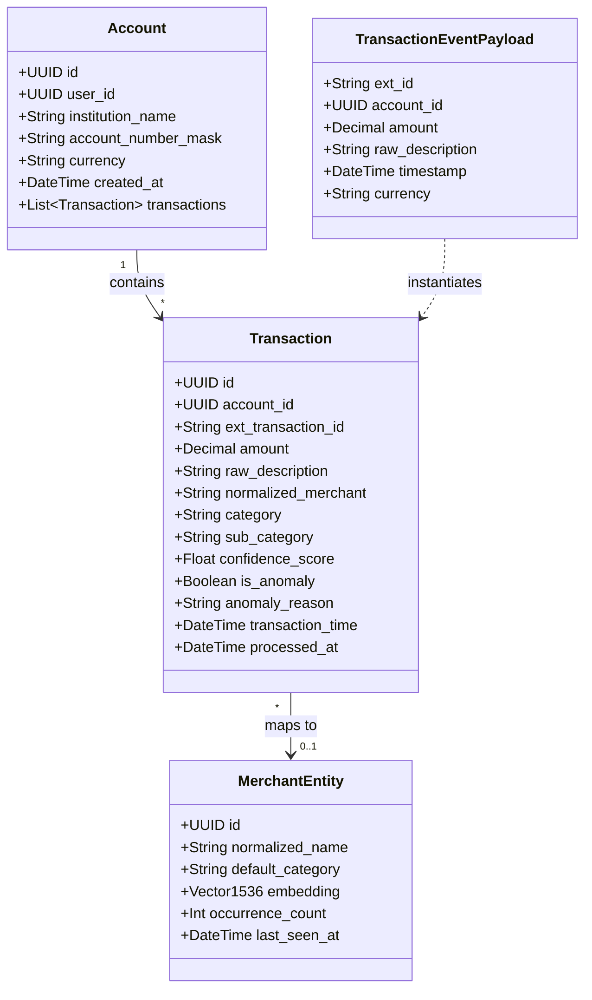
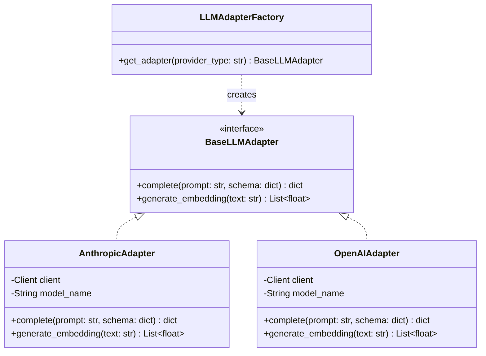
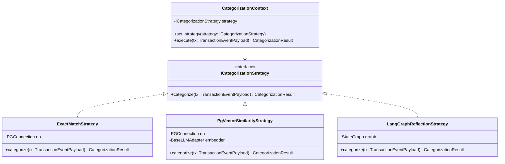
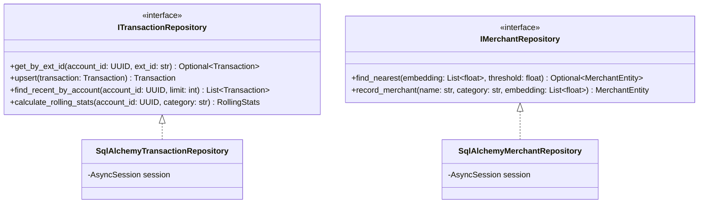

# Class & Entity Design Specification: Multi-Account Financial Categorizer & Intelligence Agent

## 1. Domain Entities & UML Class Diagram



---

## 2. Design Patterns

### 2.1 Factory & Adapter Pattern (LLM Model Providers)

To insulate the core agent graph from specific model vendors (Anthropic, OpenAI, or local vLLM), we employ an Adapter pattern unified by an abstract base interface and instantiated via a Model Factory.



#### Implementation Blueprint (Python 3.12)
```python
from abc import ABC, abstractmethod
from typing import Any, Dict, List
import os

class BaseLLMAdapter(ABC):
    @abstractmethod
    async def complete(self, prompt: str, schema: Dict[str, Any]) -> Dict[str, Any]:
        """Produce structured JSON output matching schema."""
        pass

    @abstractmethod
    async def generate_embedding(self, text: str) -> List[float]:
        """Generate 1536-dimensional dense embedding."""
        pass

class AnthropicAdapter(BaseLLMAdapter):
    def __init__(self, api_key: str, model: str = "claude-3-5-sonnet-20241022"):
        self.model = model
        # Initialized with anthropic.AsyncAnthropic

    async def complete(self, prompt: str, schema: Dict[str, Any]) -> Dict[str, Any]:
        # Implementation via Claude Tool Calling / JSON Output
        ...

    async def generate_embedding(self, text: str) -> List[float]:
        # Embeddings delegated to Voyage AI or OpenAI embeddings
        ...

class LLMAdapterFactory:
    @staticmethod
    def create(provider: str | None = None) -> BaseLLMAdapter:
        provider = provider or os.getenv("LLM_PROVIDER", "openai").lower()
        if provider == "anthropic":
            return AnthropicAdapter(api_key=os.environ["ANTHROPIC_API_KEY"])
        elif provider == "openai":
            # return OpenAIAdapter(...)
            ...
        raise ValueError(f"Unsupported LLM provider: {provider}")
```

---

### 2.2 Strategy Pattern (Transaction Categorization Pipeline)

Categorization is dynamically resolved through a Strategy pattern. When high-confidence historical matches exist, fast-path vector resolution executes. When an unseen merchant appears, the reflective LLM strategy engages.



---

## 3. Data Access Patterns (Repository & Unit of Work)

The service enforces strict separation of concerns using the Repository Pattern combined with SQLAlchemy async sessions.



### PostgreSQL Schema DDL with pgvector (SQLAlchemy)

```sql
CREATE EXTENSION IF NOT EXISTS "uuid-ossp";
CREATE EXTENSION IF NOT EXISTS "vector";

-- Accounts Table
CREATE TABLE accounts (
    id UUID PRIMARY KEY DEFAULT uuid_generate_v4(),
    user_id UUID NOT NULL,
    institution_name VARCHAR(100) NOT NULL,
    account_number_mask VARCHAR(10) NOT NULL,
    currency VARCHAR(3) DEFAULT 'USD',
    created_at TIMESTAMPTZ DEFAULT NOW()
);

-- Merchant Vector Cache
CREATE TABLE merchant_entities (
    id UUID PRIMARY KEY DEFAULT uuid_generate_v4(),
    normalized_name VARCHAR(255) UNIQUE NOT NULL,
    default_category VARCHAR(100) NOT NULL,
    embedding vector(1536) NOT NULL,
    occurrence_count INT DEFAULT 1,
    last_seen_at TIMESTAMPTZ DEFAULT NOW()
);

-- HNSW Vector Index for sub-millisecond similarity lookup
CREATE INDEX ON merchant_entities USING hnsw (embedding vector_cosine_ops)
WITH (m = 16, ef_construction = 64);

-- Partitioned Transactions Table
CREATE TABLE transactions (
    id UUID PRIMARY KEY DEFAULT uuid_generate_v4(),
    account_id UUID NOT NULL REFERENCES accounts(id) ON DELETE CASCADE,
    ext_transaction_id VARCHAR(255) NOT NULL,
    amount NUMERIC(12, 2) NOT NULL,
    raw_description TEXT NOT NULL,
    normalized_merchant VARCHAR(255),
    category VARCHAR(100) NOT NULL,
    sub_category VARCHAR(100),
    confidence_score REAL NOT NULL,
    is_anomaly BOOLEAN DEFAULT FALSE,
    anomaly_reason TEXT,
    transaction_time TIMESTAMPTZ NOT NULL,
    processed_at TIMESTAMPTZ DEFAULT NOW(),
    CONSTRAINT uq_account_ext_tx UNIQUE (account_id, ext_transaction_id)
);

CREATE INDEX idx_transactions_account_time ON transactions(account_id, transaction_time DESC);
CREATE INDEX idx_transactions_category ON transactions(category);
```
