# Visual Feature Walkthrough & Interface Guide

This guide provides a comprehensive visual and functional walkthrough of the **Multi-Account Financial Categorizer & Intelligence Agent**. Each section details a core feature of the web interface, accompanied by high-resolution browser captures and explanations of underlying architecture and user workflows.

---

## Table of Contents
1. [Authentication & Workspace Access](#1-authentication--workspace-access)
2. [Executive Overview Dashboard](#2-executive-overview-dashboard)
3. [Real-Time Activity Feed & Filtering](#3-real-time-activity-feed--filtering)
4. [Transaction Inspection & AI Transparency Modal](#4-transaction-inspection--ai-transparency-modal)
5. [Monthly Spending Plan & Category Budgets](#5-monthly-spending-plan--category-budgets)
6. [Spending Target Configuration](#6-spending-target-configuration)
7. [Anomaly Detection & Review Queue](#7-anomaly-detection--review-queue)
8. [Financial Intelligence & System Guide Modal](#8-financial-intelligence--system-guide-modal)
9. [Executive Dark Mode](#9-executive-dark-mode)
10. [Multi-Language Localization (English & Spanish)](#10-multi-language-localization-english--spanish)
11. [Mobile Responsive Design](#11-mobile-responsive-design)
12. [Automated Screenshot Generation](#12-automated-screenshot-generation)

---

## 1. Authentication & Workspace Access

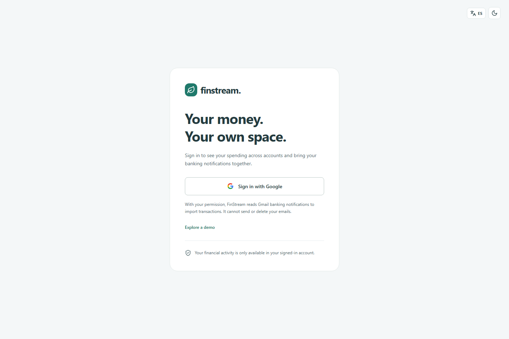

### Purpose & User Experience
The entry view establishes an executive, distraction-free environment with two authentication paths:
- **Sign in with Google (OAuth 2.0):** Grants secure, read-only access to automated Gmail banking notification imports. Authenticated users receive an isolated account namespace and multi-device session continuity.
- **Explore Demo Workspace:** Provides instant, one-click access to a pre-populated financial environment with sample checking, credit, and savings accounts. Prospective users and evaluators can interact with the full feature suite without granting third-party permissions.

### Architectural Highlights
- **Strictly Scoped Permissions:** Google OAuth requests only `https://www.googleapis.com/auth/gmail.readonly` access. No write, send, or profile modification permissions are ever requested.
- **Stateless OAuth Verification:** State tokens are cryptographically randomized, bound to secure HttpOnly cookies, and validated via Redis with a 10-minute time-to-live (TTL).
- **Row-Level Account Isolation:** Every imported transaction and account record is bound to the verified subject identity in PostgreSQL, preventing cross-tenant data leakage.

---

## 2. Executive Overview Dashboard

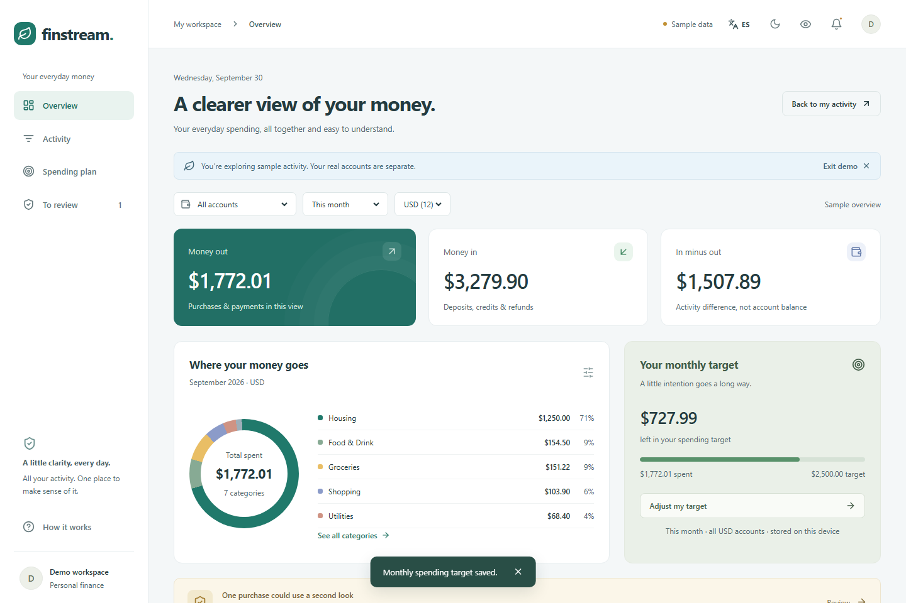

### Purpose & User Experience
The primary cockpit consolidates fragmented multi-account telemetry into a single, cohesive financial command center:
- **Primary Metric Cards:** At-a-glance summaries for **Total Inflow**, **Total Outflow**, **Net Position**, and **Anomaly Alerts**.
- **Monthly Spending Plan Card:** Real-time budget progress bar showing currency spent against user-defined monthly caps and remaining days in the active billing cycle.
- **Category Expense Breakdown:** Interactive donut chart illustrating relative allocation across essential spending buckets (Groceries, Housing, Dining, Subscriptions, Utilities, Shopping, and Travel).
- **Global Navigation Bar:** Top-level controls for language switching (English/Spanish), theme toggle (Light/Dark mode), Gmail synchronizer status, and user profile management.

### Architectural Highlights
- **Real-Time Hydration:** Aggregate figures update dynamically via Server-Sent Events (SSE) as new webhook transactions are processed by the worker service.
- **Dynamic Currency Formatting:** Monetary values automatically adjust based on active account currencies and locale standards.

---

## 3. Real-Time Activity Feed & Filtering

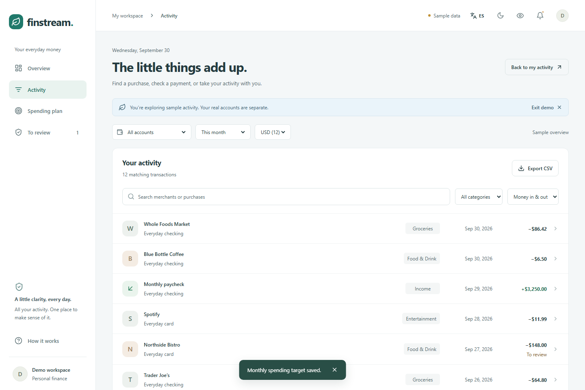

### Purpose & User Experience
The **Activity** tab provides an interactive, low-latency ledger of all ingested financial events across connected accounts:
- **Instant Search:** Debounced full-text search across merchant names, card masks, notes, and raw bank descriptors.
- **Multi-Category Filtering:** Dropdown filter allowing users to isolate single or grouped transaction categories.
- **Direction Filters:** Quick-toggle buttons to filter by **All**, **Inflow (Credits)**, or **Outflow (Debits)**.
- **Live Sync Indicator:** Real-time pulse indicator showing active SSE channel connectivity with automated reconnect handling.
- **Data Export:** Instant **Export to CSV** utility generating standardized accounting exports of filtered records.

### Architectural Highlights
- **Sub-50ms Response SLA:** Backed by indexed PostgreSQL queries with cursor-based pagination.
- **Consistent Payee Normalization:** Obscure bank descriptors are automatically replaced with standardized merchant names generated by the AI pipeline.

---

## 4. Transaction Inspection & AI Transparency Modal

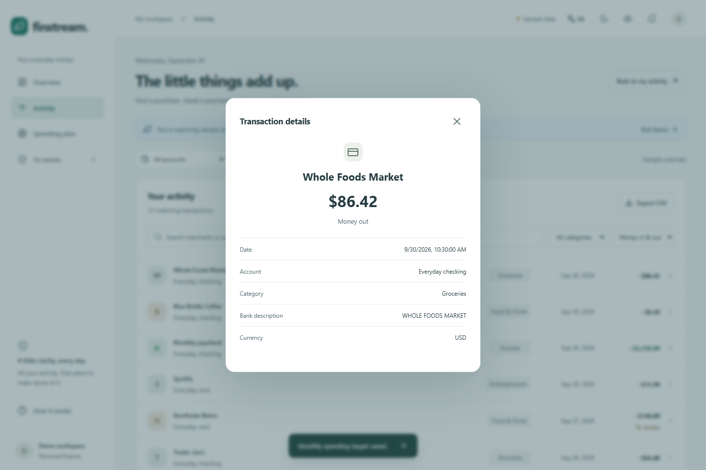

### Purpose & User Experience
Clicking any transaction in the ledger opens the **Transaction Audit Dialog**, providing total transparency into how the intelligence agent resolved the transaction:
- **Financial Metadata:** Clean merchant name, exact timestamp, originating institution, account mask, and payment rail.
- **Categorization Provenance:** Displays the assigned category, confidence score, and specific resolution tier utilized:
  1. *Exact Deterministic Match* (Cached merchant dictionary)
  2. *pgvector Semantic Similarity* (HNSW vector index embedding match)
  3. *LangGraph Reflection Agent* (LLM iterative self-correction loop)
- **Anomaly Detection Rationale:** Clear natural-language rationale explaining why an expense was flagged (e.g., spending spikes relative to a rolling 90-day baseline).
- **Raw Payee Audit Trail:** Verbatim bank descriptor string preserved for auditing and reconciliation.

---

## 5. Monthly Spending Plan & Category Budgets

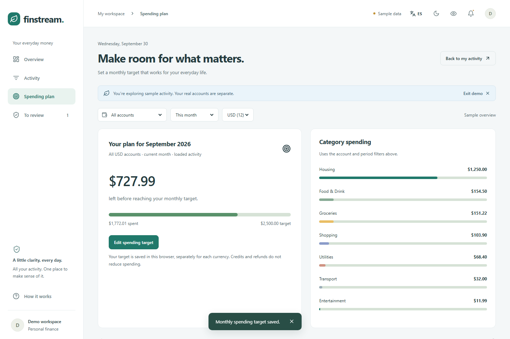

### Purpose & User Experience
The **Spending Plan** tab transitions users from reactive balance tracking to proactive cash-flow governance:
- **Target Tracking Bar:** Visual progress gauge indicating percentage of budget consumed, color-coded based on pacing risk.
- **Daily Burn Rate Guidance:** Calculated daily spending allowance remaining to maintain target adherence through month end.
- **Granular Category Breakdown:** Vertical allocation bars highlighting which expense categories represent the highest cash-flow pressure.

---

## 6. Spending Target Configuration

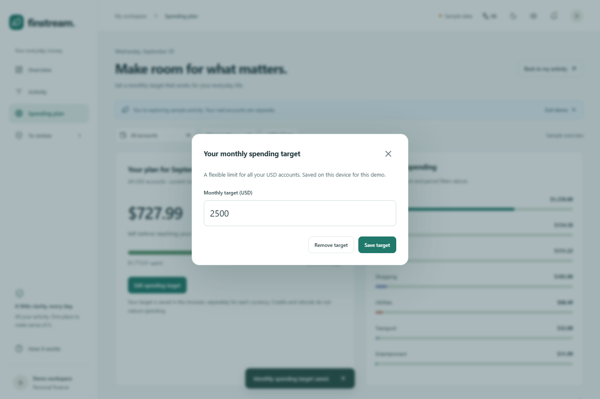

### Purpose & User Experience
Clicking **Set target** or **Adjust Target** opens the configuration dialog:
- **Currency-Scoped Input:** Input field configured to match the user's active ledger currency.
- **Month-to-Date Context:** Displays current cumulative monthly spending to assist users in establishing realistic thresholds.
- **Instant Re-Calculation:** Submitting a new target recalculates utilization percentages and burn-rate pacing without page refreshes.

---

## 7. Anomaly Detection & Review Queue

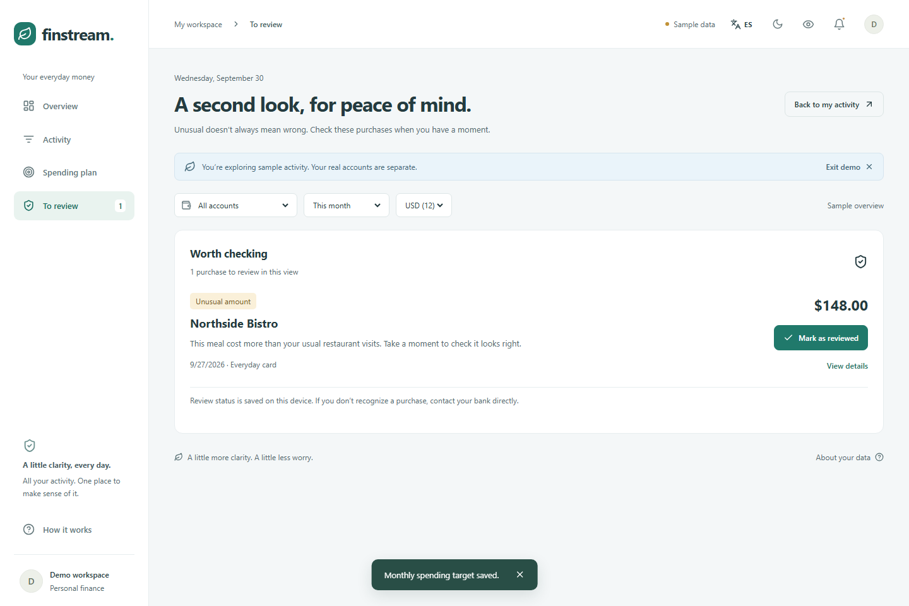

### Purpose & User Experience
The **To Review** tab isolates suspicious, atypical, or outlier transactions identified by the background statistical engine:
- **Outlier Highlighting:** Prominent amber alerts flagging abnormal ticket sizes or suspicious payee descriptors.
- **Triage Action:** Users can review detection rationales and click **Mark as Reviewed** to dismiss flags once verified.
- **Zero Inbox State:** Clean confirmation message when all anomalies have been audited.

### Architectural Highlights
- **Rolling Z-Score Evaluation:** Transactions exceeding \( \mu + 2.5\sigma \) for a specific merchant or category trigger automatic escalation to the review queue.
- **Recurring Fee Spike Alerts:** Detects price increases on existing subscription services (e.g., an unexpected 25% price increase on a SaaS plan).

---

## 8. Financial Intelligence & System Guide Modal

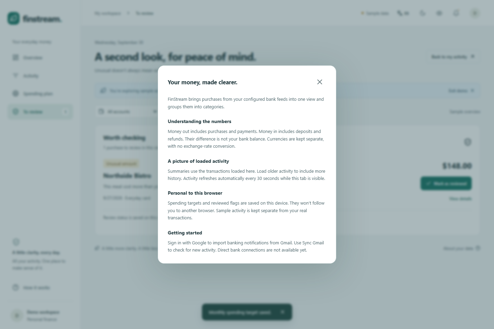

### Purpose & User Experience
Accessible via the **How it works** button in the header, this modal provides users with an accessible architectural summary:
- **Data Ingestion Workflow:** Explains how webhooks and Gmail notifications are ingested into the Apache Kafka streaming pipeline.
- **AI Processing Pipeline:** Details the three-tier resolution strategy combining dictionary caches, vector embeddings, and LangGraph agents.
- **Local Persistence & Privacy:** Clarifies what data is persisted, how sessions are secured, and guarantees regarding financial credential isolation.

---

## 9. Executive Dark Mode

The interface includes a custom-engineered **Dark Mode** designed for reduced eye strain during extended financial analysis and low-light environments.

### Dark Mode: Executive Overview
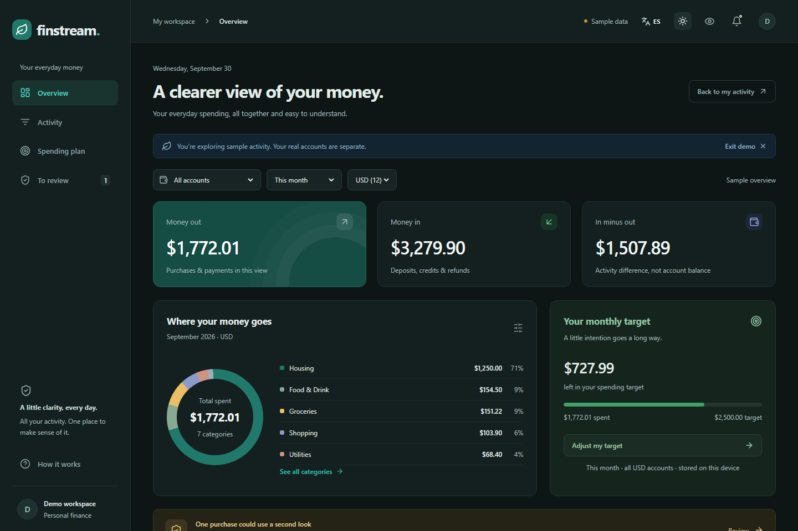

### Dark Mode: Activity Feed
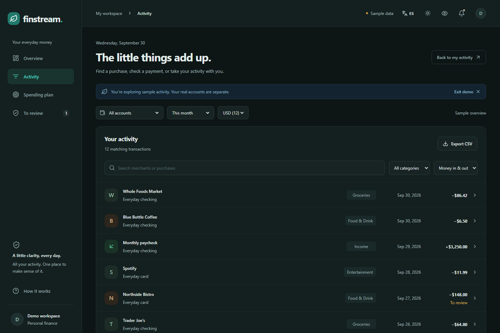

### Design & Aesthetic Implementation
- **Deep Slate Palette:** Built using Tailwind CSS `dark:` variants with deep slate surfaces (`bg-slate-900`, `bg-slate-800`), refined borders (`border-slate-700`), and high-contrast typography (`text-slate-100`, `text-slate-300`).
- **Semantic Accents:** High-visibility green indicators for positive cash inflows and warm amber indicators for anomaly alerts.
- **System Preference Detection:** Automatically adheres to the user's operating system preference on initial load, with manual override saved to `localStorage`.

---

## 10. Multi-Language Localization (English & Spanish)

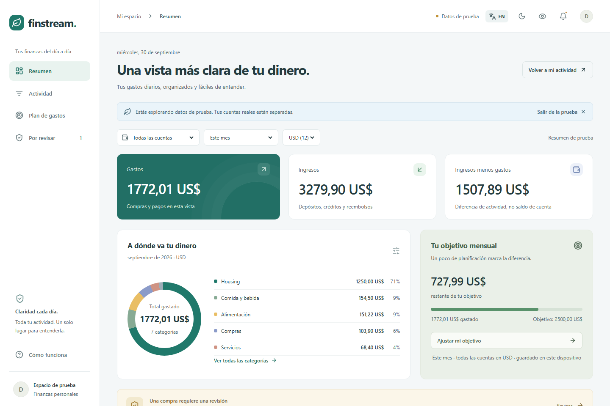

### Purpose & User Experience
The application features comprehensive bilingual support (English & Spanish):
- **Instant Language Toggle:** Dedicated selector button (`EN` / `ES`) in the primary navigation header.
- **Complete UI Translation:** All metric titles (*Entradas Totales*, *Salidas Totales*, *Posición Neta*), navigation tabs (*Resumen*, *Actividad*, *Plan de Gasto*, *Por Revisar*), dialog descriptions, and category taxonomy labels (*Comida y Restaurantes*, *Compras*, *Suscripciones*) dynamically translate.
- **Localized Date & Currency Formatting:** Timestamps and numbers format according to regional conventions.

---

## 11. Mobile Responsive Design

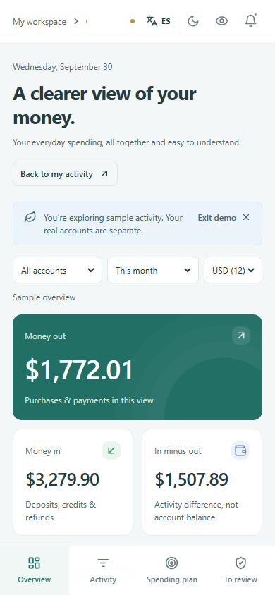

### Purpose & User Experience
The web application is fully responsive and optimized for mobile devices and tablets:
- **Mobile Navigation:** Touch-friendly bottom tab bar providing fluid switching between Dashboard, Activity, Spending Plan, and Review views.
- **Stacked Metric Cards:** Overview metrics stack into intuitive, scrollable single-column cards.
- **Adaptive Modals:** Transaction details and target adjustment dialogs render as bottom-sheet cards on compact screens.

---

## 12. Automated Screenshot Generation

All screenshots in this guide are automatically generated directly from the live running browser using Playwright end-to-end automation. This ensures documentation never goes out of sync with UI updates.

### Test Script Location
The generator script is located at:
[`frontend/e2e/generate-docs-screenshots.spec.ts`](file:///c:/Repositories/GHProjects/multi-account-finance-agent/frontend/e2e/generate-docs-screenshots.spec.ts)

### How to Regenerate Screenshots Locally
To capture a fresh set of screenshots:

1. Ensure the frontend development server or preview server is running:
   ```sh
   cd frontend
   pnpm run dev
   ```

2. Run the Playwright screenshot suite:
   ```sh
   cd frontend
   npx playwright test e2e/generate-docs-screenshots.spec.ts --project=chromium
   ```

3. The updated PNG assets will be output directly to `docs/assets/screenshots/`.
