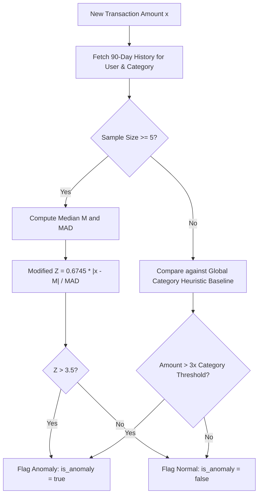

# Service Specification: Real-Time Anomaly Detection Engine

## 1. Overview
The **Anomaly Detection Engine** evaluates newly categorized transactions against the user's historical expenditure profiles. It detects:
1. **Statistical Outliers:** Sudden charge amounts substantially exceeding historical standard deviations for a specific category.
2. **Frequency Outliers:** Multiple rapid charges from the same merchant within a narrow time window (velocity check / card theft).
3. **Recurring Stealth Creep:** Unannounced price increases on recurring subscriptions (e.g. Netflix jumping from $15.99 to $22.99).

---

## 2. Statistical Methodology (Rolling Modified Z-Score)

For category amount anomalies, the engine avoids traditional Gaussian assumptions (which skew on sparse data) and implements a **Median Absolute Deviation (MAD)** modified Z-score computed across 90 days of transactions for that user and category.



### Mathematical Formula:
$$M = \text{Median}(X)$$
$$\text{MAD} = \text{Median}(|X_i - M|)$$
$$M_i = \frac{0.6745 \cdot (x - M)}{\text{MAD}}$$

If $M_i > 3.5$, the transaction is classified as an anomaly.

---

## 3. High-Performance SQL Aggregation Query

Instead of pulling thousands of raw rows into Python memory, the baseline statistics are calculated inside PostgreSQL via an analytic query:

```sql
WITH user_history AS (
    SELECT amount 
    FROM transactions 
    WHERE account_id = :account_id 
      AND category = :category 
      AND transaction_time >= NOW() - INTERVAL '90 days'
),
stats AS (
    SELECT 
        percentile_cont(0.5) WITHIN GROUP (ORDER BY amount) AS median_amount,
        COUNT(*) AS total_tx_count
    FROM user_history
)
SELECT 
    s.median_amount,
    s.total_tx_count,
    percentile_cont(0.5) WITHIN GROUP (ORDER BY ABS(uh.amount - s.median_amount)) AS mad
FROM user_history uh, stats s
GROUP BY s.median_amount, s.total_tx_count;
```

---

## 4. Anomaly Alert Payload & Output Schema

When `is_anomaly = True`, the transaction is enriched before database insertion:

```json
{
  "is_anomaly": true,
  "anomaly_reason": "Outlier Amount ($340.00 vs Category Median $32.00, Modified Z-Score: 6.8). Flagged for human review.",
  "anomaly_metadata": {
    "metric": "modified_z_score",
    "score": 6.8,
    "historical_median": 32.00,
    "historical_mad": 6.50,
    "sample_size": 47
  }
}
```
This payload is published via Server-Sent Events (SSE) directly to the React dashboard's alert notification center.
