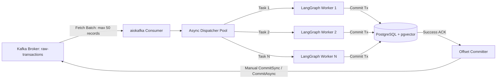

# Service Specification: Kafka Consumer Group & Ingestion Stream

## 1. Architectural Role
The Kafka Consumer Service is a decoupled Python worker running on AWS ECS Fargate that processes raw financial transaction events from the `raw-transactions` Kafka topic. It guarantees:
1. **Strict sequential processing** per account via partition hashing (`partition_key = account_id.bytes`).
2. **At-least-once delivery semantics** with manual commit offsets after database transaction commits.
3. **Dead Letter Queue (DLQ)** isolation for poisoned payloads.

---

## 2. Kafka Topic Configuration

```yaml
Topics:
  - Name: raw-transactions
    Partitions: 12
    ReplicationFactor: 3
    RetentionHours: 168 # 7 days
    CleanupPolicy: delete
    MinInSyncReplicas: 2

  - Name: raw-transactions-dlq
    Partitions: 3
    ReplicationFactor: 3
    RetentionHours: 720 # 30 days
```

---

## 3. Consumer Concurrency & Backpressure Architecture



### Worker Lifecycle Parameters
* **Framework:** `aiokafka` (asyncio-native Kafka client for Python)
* **Group ID:** `finance-agent-categorizer-group`
* **Fetch Settings:**
  * `max_poll_records`: 50
  * `max_poll_interval_ms`: 300,000 (5 minutes, accommodating multi-step LLM reflections)
  * `session_timeout_ms`: 45,000
  * `auto_offset_reset`: `earliest`
  * `enable_auto_commit`: `False` (CRITICAL: Commits occur exclusively after successful PostgreSQL write)

---

## 4. Error Handling & Dead Letter Queue (DLQ)

```python
from aiokafka import AIOKafkaConsumer, AIOKafkaProducer
import json
import logging

logger = logging.getLogger("KafkaConsumerService")

async def consume_loop(consumer: AIOKafkaConsumer, producer: AIOKafkaProducer, agent_pipeline):
    async for msg in consumer:
        payload = json.loads(msg.value.decode("utf-8"))
        retries = 0
        max_retries = 3
        success = False

        while retries < max_retries and not success:
            try:
                # Execute agentic pipeline
                await agent_pipeline.process_transaction(payload)
                success = True
                # Acknowledge offset manually
                await consumer.commit({msg.tp: msg.offset + 1})
            except Exception as e:
                retries += 1
                logger.warning(f"Error processing record {payload.get('ext_transaction_id')}, attempt {retries}/{max_retries}: {e}")
                await asyncio.sleep(2 ** retries)

        if not success:
            logger.error(f"Routing transaction to DLQ: {payload.get('ext_transaction_id')}")
            dlq_message = {
                "original_payload": payload,
                "error": str(e),
                "failed_at": datetime.utcnow().isoformat(),
                "topic": msg.topic,
                "partition": msg.partition,
                "offset": msg.offset
            }
            await producer.send_and_wait("raw-transactions-dlq", json.dumps(dlq_message).encode("utf-8"))
            await consumer.commit({msg.tp: msg.offset + 1})
```
