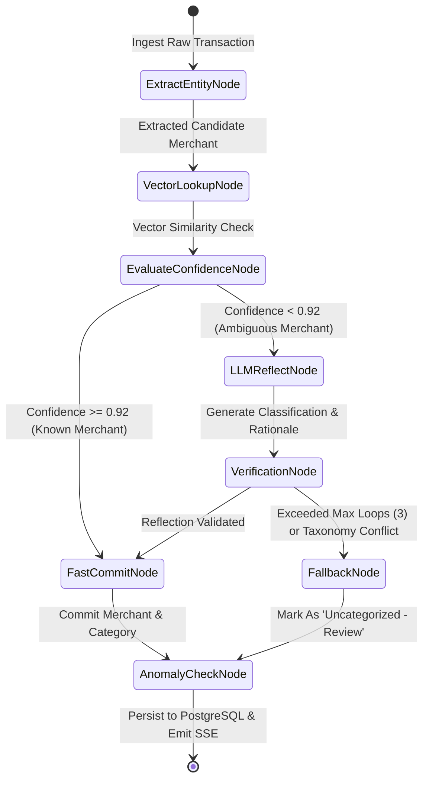

# Service Specification: LangGraph Reflection & Entity Resolution Agent

## 1. Overview
The **LangGraph Reflection Agent** is responsible for transforming noisy, unstructured banking strings into canonical merchant names, assign them to a fixed financial taxonomy, and verify classification accuracy using an automated reflection cycle.

---

## 2. State Machine Graph Topology



---

## 3. Agent State Schema (Pydantic / TypedDict)

```python
from typing import TypedDict, Optional, List
from decimal import Decimal

class AgentTransactionState(TypedDict):
    # Input Data
    account_id: str
    ext_transaction_id: str
    amount: Decimal
    raw_description: str
    transaction_time: str
    
    # Entity Resolution State
    extracted_merchant: Optional[str]
    vector_similarity_score: float
    matched_merchant_id: Optional[str]
    
    # Classification & Reflection
    assigned_category: Optional[str]
    assigned_subcategory: Optional[str]
    confidence_score: float
    reflection_iteration: int
    critique_notes: List[str]
    is_valid: bool
    
    # Anomaly State
    is_anomaly: bool
    anomaly_reason: Optional[str]
```

---

## 4. Node Logic & Execution Flow

### Node 1: `ExtractEntityNode`
* Strips noise tokens (e.g. `SQ *`, `TST*`, `PAYPAL *`, store IDs `#412`, telephone numbers, ZIP codes).
* Outputs normalized candidate string: `SQ *BLUE BOTTLE COFFEE HAYES 94102` -> `Blue Bottle Coffee`.

### Node 2: `VectorLookupNode`
* Generates 1536-d embedding for the candidate merchant name.
* Executes nearest-neighbor search against `merchant_entities` in PostgreSQL using `pgvector` HNSW cosine distance (`<=>`).
* If `1 - cosine_distance >= 0.92`, state immediately inherits the historical default category without making an LLM invocation (saving cost and sub-second latency).

### Node 3: `LLMReflectNode` & `VerificationNode`
* If candidate is new or vector score is `< 0.92`, calls LLM with strict taxonomy constraint.
* **Taxonomy Schema:**
  * `Food & Dining` -> `Coffee Shops`, `Restaurants`, `Groceries`, `Bars`
  * `Transportation` -> `Rideshare`, `Gas / Fuel`, `Transit / Tolls`
  * `Utilities & Bills` -> `Electric`, `Internet`, `Mobile Phone`
  * `Shopping & Retail` -> `Clothing`, `Electronics`, `Home Goods`
* **Reflection Prompt:**
  > *"You assigned 'Food & Dining -> Groceries' to 'Shell Oil 0412'. Critically evaluate this assignment given the amount of $45.00 and merchant naming pattern. Could this be Gas/Fuel instead? If uncertain, revise category and justify."*
* The loop iterates at most twice (`reflection_iteration <= 2`). If still ambiguous, falls back to `Uncategorized - Manual Review`.

---

## 5. Langfuse Distributed Tracing Integration

Every graph run is decorated with the `@observe()` handler from the Langfuse SDK:

```python
from langfuse.decorators import observe, langfuse_context

@observe(name="langgraph_transaction_reflection")
async def execute_graph(state: AgentTransactionState):
    langfuse_context.update_current_trace(
        user_id=state["account_id"],
        session_id=state["ext_transaction_id"],
        tags=["production", "categorization_agent"]
    )
    # Invoke compiled LangGraph
    final_state = await compiled_graph.ainvoke(state)
    return final_state
```
This records:
* Total token expenditure per transaction
* Graph branch latency (Fast-path vector lookup vs. Reflective LLM)
* Iteration counts and critique scores for continuous evaluation
